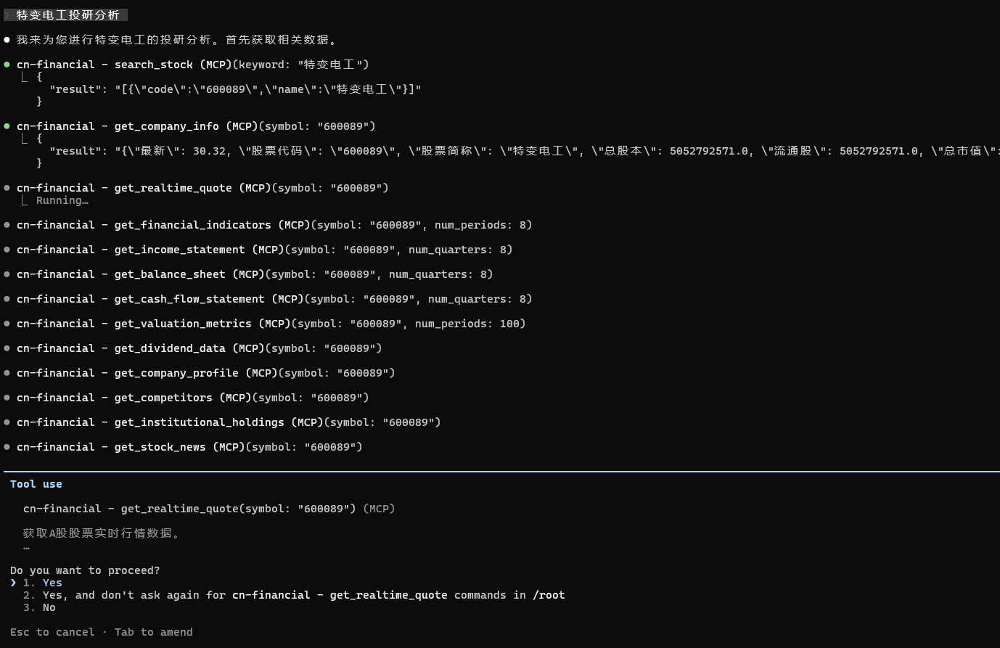
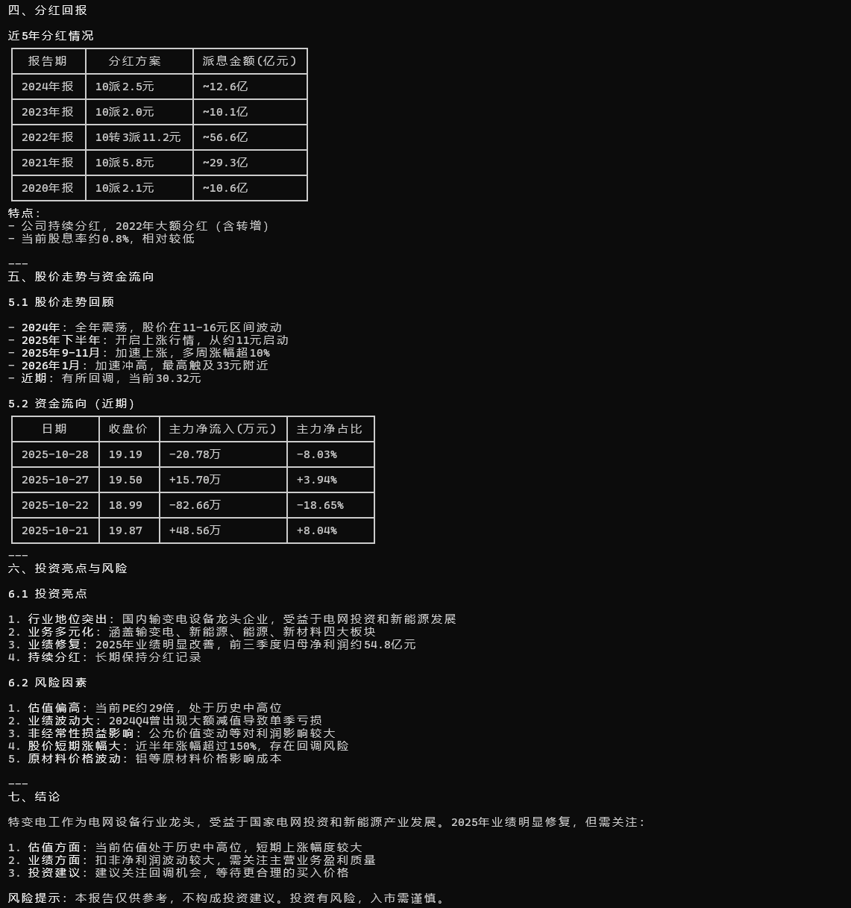

# cn-financial-mcp

<p align="center">
  <strong>cn大陆金融数据 MCP Server</strong><br/>
  基于 <a href="https://akshare.akfamily.xyz">AKShare</a> · 支持 <a href="https://modelcontextprotocol.io">MCP 协议</a> · 61 个金融工具
</p>

<p align="center">
  
  
  
  
</p>

---

## 📸 Demo

> 在 Claude Code 中通过 MCP 工具查询中国西电的盘口走势以及投研分析

<p align="center">
  
</p>

<p align="center">
  
</p>

---

## 简介

**cn-financial-mcp** 是一个遵循 [Model Context Protocol (MCP)](https://modelcontextprotocol.io) 标准的金融数据服务器，专注于cn大陆市场。它让任何支持 MCP 的 AI Agent（如 Claude Code、Cursor、自定义 Agent）都能直接调用 A 股行情、财报、行业、宏观经济等 **42 个金融工具**，无需 API Key，开箱即用。

底层数据来源于 [AKShare](https://akshare.akfamily.xyz)、eltdx 通达信协议、东财直连和同花顺，提供 61 个金融工具，覆盖行情、财务、估值、行业、新闻、宏观、信号数据等全方位金融数据。

---

## ✨ 功能一览

| 模块 | 工具数 | 说明 |
|:-----|:------:|:-----|
| **公司信息** | 4 | 股票搜索、公司概况、主营构成、竞争对手 |
| **行情数据** | 4 | 实时行情、历史 K 线（日/周/月）、市值、股票列表 |
| **财务报表** | 8 | 利润表、资产负债表、现金流量表、财务指标、增长率、分部收入 |
| **估值分析** | 4 | PE/PB/PS 时序、分红历史、机构持仓、分析师评级 |
| **行业板块** | 5 | 行业列表、成分股、概念板块、板块资金流、行业估值 |
| **市场总览** | 5 | 指数概览、个股资金流、北向资金、涨跌停池、龙虎榜 |
| **新闻公告** | 4 | 个股新闻、财报日历、公司公告、关键词搜索 |
| **宏观与衍生** | 8 | GDP/CPI/PMI/M2、汇率、国债收益率、融资融券、高管增减持 |
| **A股信号+品种** | 14 | 涨停归因/解禁/概念/预期/技术指标/北向/资金流/龙虎榜/行业/ETF/可转债 |
| **eltdx 通达信独有** | 5 | 集合竞价/逐笔/F10/分时/K线（AKShare无此功能） |

**合计 61 个工具**，覆盖从个股研究到宏观分析、从基础行情到信号数据的完整链路。

---

## 🚀 快速开始

### 环境要求

- Python 3.10+
- pip

### 安装

```bash
git clone https://github.com/<your-username>/cn-financial-mcp.git
cd cn-financial-mcp
pip install -e .
```

### 验证安装

```bash
PYTHONPATH=src python -m cn_financial_mcp --help
```

```
usage: __main__.py [-h] [--http] [--port PORT] [--host HOST]

cn-financial-mcp: China Financial Data MCP Server based on AKShare

options:
  -h, --help   show this help message and exit
  --http       Run in HTTP/SSE mode instead of stdio
  --port PORT  Port for HTTP/SSE mode (default: 8000)
  --host HOST  Host for HTTP/SSE mode (default: 127.0.0.1)
```

---

## 📡 部署方式

### 方式一：stdio 模式（Claude Code / Cursor）

在你的项目根目录 `.mcp.json` 中添加：

```json
{
  "mcpServers": {
    "cn-financial": {
      "type": "stdio",
      "command": "python",
      "args": ["-m", "cn_financial_mcp"],
      "env": {
        "PYTHONPATH": "/absolute/path/to/cn-financial-mcp/src"
      }
    }
  }
}
```

> 将 `/absolute/path/to/cn-financial-mcp` 替换为你的实际路径。配置好后 Agent 会自动拉起 MCP 进程。

### 方式二：HTTP/SSE 模式（通用 MCP Client）

```bash
cd cn-financial-mcp
PYTHONPATH=src python -m cn_financial_mcp --http --host 0.0.0.0 --port 8000
```

MCP Client 连接 endpoint：

```
http://<your-ip>:8000/sse
```

### 方式三：Docker

```bash
cd cn-financial-mcp
docker compose up -d
```

服务暴露在 `http://localhost:8000`。

---

## 🛠 工具清单

<details>
<summary><b>公司信息 (company_info)</b></summary>

| 工具 | 说明 |
|:-----|:-----|
| `search_stock` | 按名称/代码模糊搜索 A 股 |
| `get_company_info` | 获取公司基本信息（行业、市值、股本） |
| `get_company_profile` | 获取主营业务构成及收入占比 |
| `get_competitors` | 获取同行业竞争对手列表 |

</details>

<details>
<summary><b>行情数据 (price_data)</b></summary>

| 工具 | 说明 |
|:-----|:-----|
| `get_realtime_quote` | 获取实时行情（最新价、涨跌幅、成交量） |
| `get_historical_price` | 获取历史 K 线（日/周/月，支持前复权/后复权） |
| `get_market_capitalization` | 获取总市值与流通市值 |
| `get_stock_list` | 获取 A 股完整列表，支持市值筛选 |

</details>

<details>
<summary><b>财务报表 (financial_stmt)</b></summary>

| 工具 | 说明 |
|:-----|:-----|
| `get_income_statement` | 利润表 |
| `get_balance_sheet` | 资产负债表 |
| `get_cash_flow_statement` | 现金流量表 |
| `get_financial_line_item` | 自定义查询单项科目 |
| `get_financial_indicators` | 综合财务指标（ROE、毛利率等） |
| `get_growth_rates` | 营收/利润增长率 |
| `get_per_share_data` | 每股指标（EPS、BPS等） |
| `get_segments_revenue` | 分部收入明细 |

</details>

<details>
<summary><b>估值分析 (valuation)</b></summary>

| 工具 | 说明 |
|:-----|:-----|
| `get_valuation_metrics` | PE/PB/PS 历史时序 |
| `get_dividend_data` | 分红派息历史 |
| `get_institutional_holdings` | 十大流通股东 |
| `get_analyst_rating` | 分析师评级与盈利预测 |

</details>

<details>
<summary><b>行业板块 (industry)</b></summary>

| 工具 | 说明 |
|:-----|:-----|
| `get_industry_list` | 行业板块列表 |
| `get_industry_stocks` | 行业成分股 |
| `get_concept_list` | 概念板块列表 |
| `get_sector_fund_flow` | 板块资金流向排名 |
| `get_industry_pe` | 行业历史行情走势 |

</details>

<details>
<summary><b>市场总览 (market)</b></summary>

| 工具 | 说明 |
|:-----|:-----|
| `get_market_overview` | 主要指数实时快照 |
| `get_money_flow` | 个股资金流向 |
| `get_north_bound_flow` | 北向资金（沪深港通）净流入 |
| `get_limit_up_down` | 当日涨停/跌停池 |
| `get_dragon_tiger` | 龙虎榜（机构活跃交易） |

</details>

<details>
<summary><b>新闻公告 (news_events)</b></summary>

| 工具 | 说明 |
|:-----|:-----|
| `get_stock_news` | 个股新闻资讯 |
| `get_financial_calendar` | 财报披露时间表 |
| `get_company_announcements` | 上市公司公告 |
| `search_news` | 按关键词搜索新闻 |

</details>

<details>
<summary><b>宏观与衍生 (macro_fx)</b></summary>

| 工具 | 说明 |
|:-----|:-----|
| `get_macro_gdp` | GDP 数据 |
| `get_macro_cpi` | CPI 数据 |
| `get_macro_pmi` | PMI 数据 |
| `get_macro_money_supply` | 货币供应量（M0/M1/M2） |
| `get_fx_rate` | 汇率查询 |
| `get_bond_yield_curve` | 国债收益率曲线 |
| `get_margin_trading` | 融资融券数据 |
| `get_insider_trading` | 高管增减持 |

</details>

<details>
<summary><b>A股信号+品种 (signal_data)</b></summary>

| 工具 | 说明 |
|:-----|:-----|
| `get_hot_stocks` | 涨停股票+主题归因（同花顺 editorial） |
| `get_lockup_expiry` | 限售解禁日历（东财 datacenter） |
| `get_concept_attribution` | 概念/行业/地域板块归属（东财 push2delay） |
| `get_profit_forecast` | 分析师一致预期EPS + Forward PE/PEG（同花顺） |
| `get_technical_indicator` | 13种技术指标（MACD/RSI/布林带/ATR等） |
| `list_technical_indicators` | 列出所有支持的技术指标及说明 |
| `get_northbound_flow_signal` | 北向资金流向（沪深股通，同花顺 hsgtApi） |
| `get_fund_flow_signal` | 个股资金流向（主力/大中小单，东财 push2） |
| `get_dragon_tiger_signal` | 龙虎榜席位明细+机构动向（东财 datacenter） |
| `get_industry_comparison_signal` | 行业横向对比排名（东财 push2） |
| `get_etf_realtime_data` | ETF实时行情（IOPV/折价率/换手率，AKShare） |
| `get_etf_kline_data` | ETF历史K线（日/周/月，支持复权，AKShare） |
| `get_cb_realtime_data` | 可转债实时行情（溢价率/转股价/评级，AKShare） |
| `get_cb_value_analysis_data` | 可转债价值分析（溢价率历史曲线，AKShare） |

</details>

<details>
<summary><b>eltdx 通达信独有 (eltdx_data)</b></summary>

| 工具 | 说明 |
|:-----|:-----|
| `eltdx_get_auction` | 集合竞价（9:15-9:25撮合过程） |
| `eltdx_get_ticks` | 逐笔成交（价格/量/买卖方向） |
| `eltdx_get_f10` | F10资料（公司概况/题材归因/财务诊断） |
| `eltdx_get_minutes` | 分时数据（1分钟K线） |
| `eltdx_get_kline` | K线（日/周/月/5m/15m/30m/60m） |

</details>

---

## 🔄 多数据源 Fallback

为应对部分数据源在云服务器环境下不稳定的问题，内置了自动多源切换：

```
请求 → 东方财富 (优先，字段最全)
         ↓ 失败
       新浪 / 腾讯 / 同花顺 (备选)
         ↓ 失败
       返回错误
```

| 功能 | 主源 | 备选源 |
|:-----|:----:|:------:|
| 实时行情 | 东方财富 | 新浪 → 新浪单股 |
| 历史 K 线 | 东方财富 | 腾讯 |
| 行业板块 | 东方财富 | 同花顺 |
| 概念板块 | 东方财富 | 同花顺 |
| 公司信息 | 东方财富 emweb | 新浪 |
| 信号数据 | AKShare | 东财直连 / 同花顺 |
| eltdx 数据 | 通达信私有协议 (TCP 7709) | 无备选（独有数据） |

> 代码始终优先尝试东方财富。只有当主源连接失败时才自动切换，对调用方完全透明。

---

## 🧪 测试

```bash
# 安装开发依赖
pip install -e ".[dev]"

# 运行单元测试
pytest tests/ -v

# 仅运行网络无关测试
pytest tests/ -v -m "not network"
```

---

## 📁 项目结构

```
cn-financial-mcp/
├── src/cn_financial_mcp/
│   ├── __init__.py
│   ├── __main__.py          # CLI 入口
│   ├── server.py             # MCP Server 实例
│   ├── tools/
│   │   ├── company_info.py   # 公司信息 (4 tools)
│   │   ├── price_data.py     # 行情数据 (4 tools)
│   │   ├── financial_stmt.py # 财务报表 (8 tools)
│   │   ├── valuation.py      # 估值分析 (4 tools)
│   │   ├── industry.py       # 行业板块 (5 tools)
│   │   ├── market.py         # 市场总览 (5 tools)
│   │   ├── news_events.py    # 新闻公告 (4 tools)
│   │   ├── macro_fx.py       # 宏观衍生 (8 tools)
│   │   ├── signal_data.py    # A股信号+品种 (14 tools)
│   │   └── eltdx_data.py     # eltdx 通达信独有 (5 tools)
│   └── utils/
│       ├── cache.py          # TTL 缓存
│       ├── fallback.py       # 多源 fallback
│       ├── formatter.py      # DataFrame → JSON
│       └── symbol.py         # 股票代码工具
├── tests/
├── docs/images/
├── pyproject.toml
├── Dockerfile
├── docker-compose.yml
└── .mcp.json
```

---

## 📄 License

[Apache-2.0](LICENSE)

---

## 🙏 致谢

- [AKShare](https://akshare.akfamily.xyz) — 开源金融数据接口库
- [eltdx](https://github.com/wolfjkd/eltdx) — 通达信私有协议 Python 实现
- [stockstats](https://github.com/jealous/stockstats) — 技术指标计算引擎
